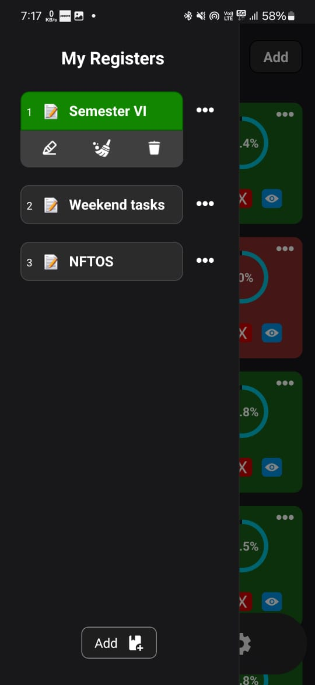
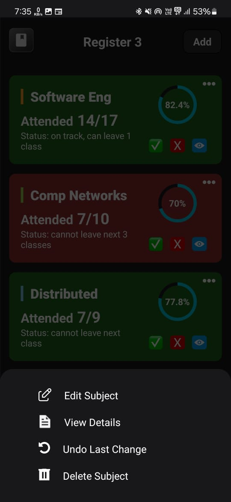

# Attendance Manager App

A **React Native** application to track and manage attendance efficiently. The app allows users to mark attendance, view attendance records, and analyze trends. Built with **React Native**, it ensures a smooth and responsive experience across both Android and iOS platforms.

## Features
- 📅 **Track Attendance**: Easily mark attendance for different classes or events.
- 📊 **Statistics & Reports**: View attendance trends and detailed reports.
- 🔔 **Reminders & Alerts**: Set alerts to remind you of low attendance.
- ☁️ **Cloud Sync (Optional)**: Sync data across multiple devices.

## App Screenshot

|  |  |  |
|------------------------|------------------------|------------------------|
|  |  |  |

## Installation & Setup

### Prerequisites
Ensure you have the following installed:
- **Node.js** (Latest LTS recommended) - [Download](https://nodejs.org/)
- **React Native CLI** or **Expo CLI**
- **Android Studio** (For Android emulator) / **Xcode** (For iOS development)

### Steps
#### 1. Clone the Repository
```sh
 git clone https://github.com/yourusername/attendance-manager.git
 cd attendance-manager
```

#### 2. Install Dependencies
```sh
 npm install
 # or
 yarn install
```

#### 3. Run the App
- For Android:
```sh
 npx react-native run-android
```
- For iOS (Mac users only):
```sh
 npx react-native run-ios
```
- If using Expo:
```sh
 npx expo start
```

## Tech Stack
- **React Native** - Frontend framework
- **Redux** - State management
- **AsyncStorage / Firebase** - Data persistence
- **React Navigation** - Seamless app navigation

## Contributing
Contributions are welcome! Feel free to fork the repository and submit a pull request.

## License
This project is licensed under the **MIT License**.

---
### 📩 Need Help?
For issues or suggestions, create a GitHub issue or contact me at [your.email@example.com].

